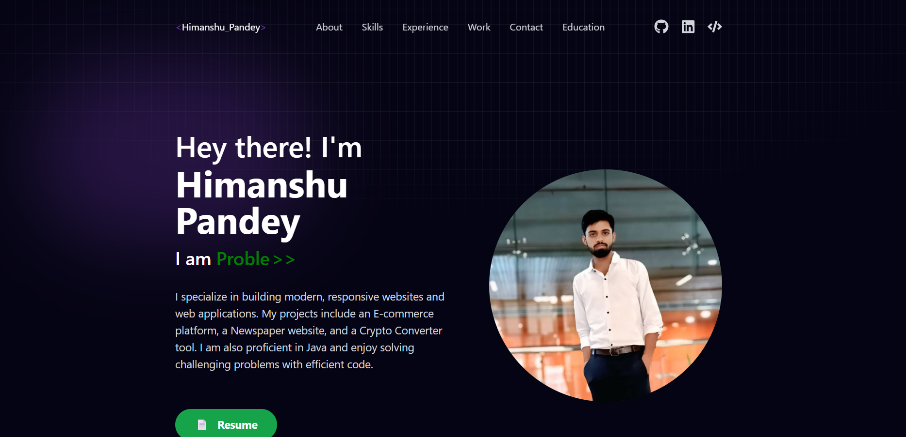
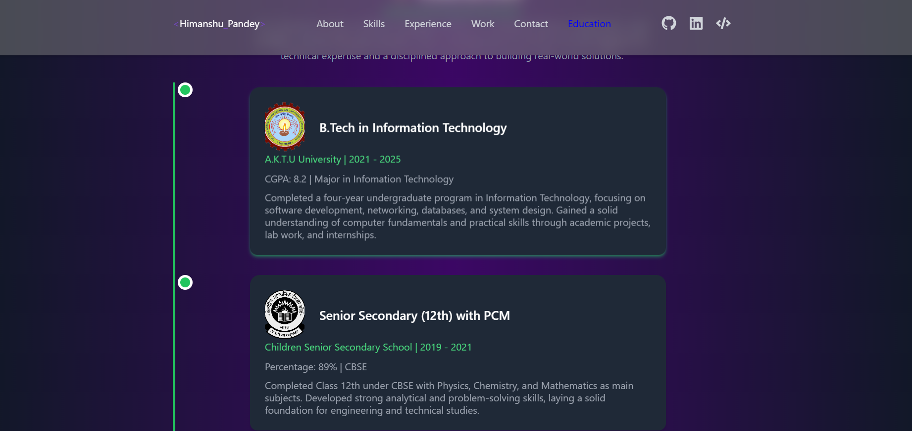
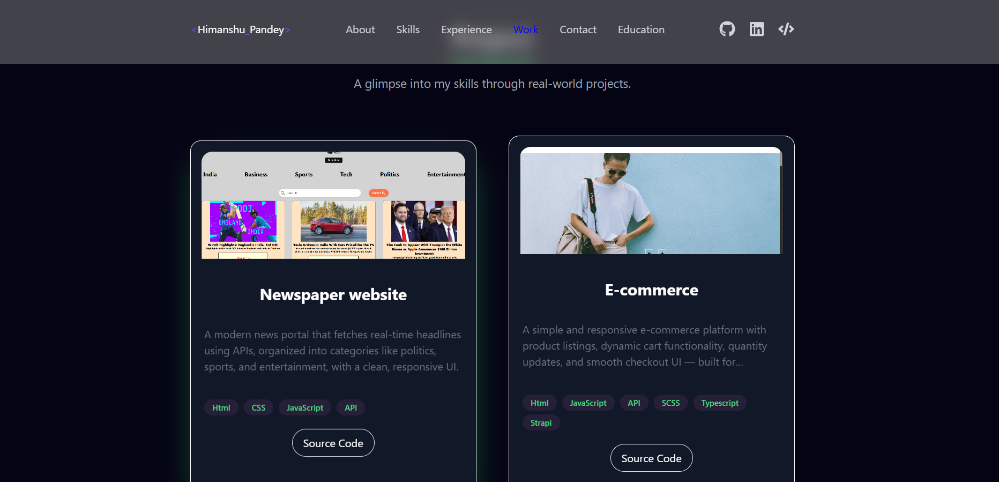

# 💼 My Portfolio - React + Vite

Welcome to my personal portfolio website built with **React**, **Vite**, and **Tailwind CSS**.  
This site showcases my **skills**, **projects**, **qualifications**, and includes a downloadable **resume** and direct **GitHub links** to all my work.

---
# Demo





## 🧠 Skills & Technologies

- **Frontend:** HTML, CSS, JavaScript, React, Tailwind CSS
- **Routing:** React Router DOM
- **Animations & Effects:** React Icons, React Typing Effect, React Simple Typewriter, React Parallax Tilt
- **Form & Email Integration:** EmailJS
- **Notifications:** React Toastify
- **Tooling & Build:** Vite, ESLint, PostCSS

---

## 📁 Features

- 🧑‍💼 About Me section
- 🛠️ Skills overview
- 🎓 Qualifications & Education
- 📄 Resume download/view
- 🔗 GitHub links to my major projects
- 📬 Contact form (via EmailJS)
- 🎨 Clean, responsive UI with animations

---

## 📂 Tech Stack / Dependencies

**Core:**
- `react`, `react-dom`, `vite`

**Styling & Layout:**
- `tailwindcss`, `postcss`, `autoprefixer`

**UI Effects & Animation:**
- `react-icons`, `react-parallax-tilt`, `react-typing-effect`, `react-simple-typewriter`

**Routing & Utilities:**
- `react-router-dom`, `prop-types`, `react-toastify`, `@emailjs/browser`

**Linting & Dev Tools:**
- `eslint`, `@eslint/js`, `eslint-plugin-react-hooks`, `@vitejs/plugin-react`, etc.

---

## 🚀 Getting  Started
Follow these steps to run the project locally:

 ### 📦 Clone the repository:

```bash
git clone https://github.com/HimanshuP13/portfolio
cd myportfolio

```
### Install dependencies
```bash
npm install
```
### Start the development server:

```bash
npm run dev
```
